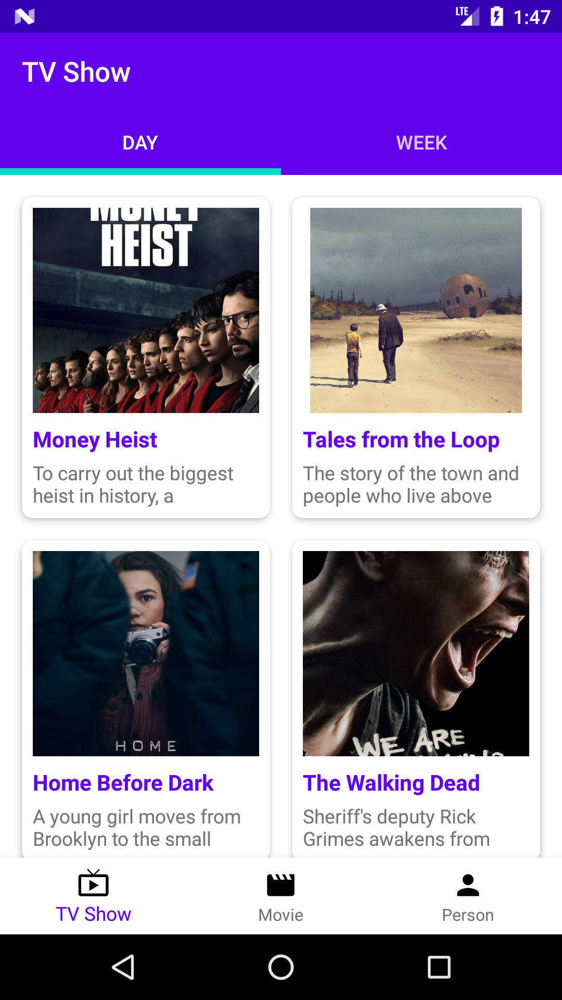
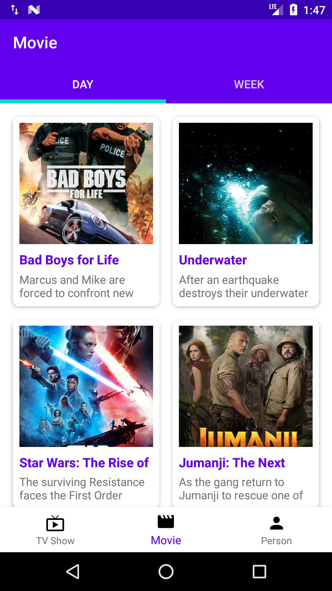
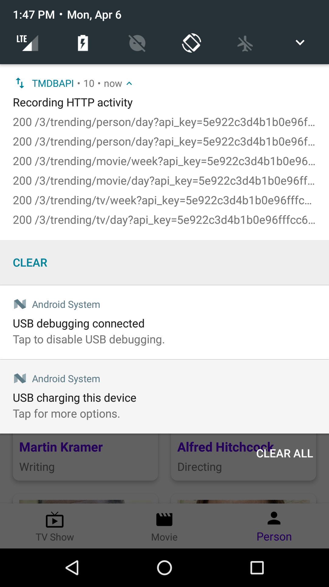

# consumable-code-movie-tmdb-api By AmirIsBack
- v1.1.2 - Development
- Stable Version

# About This Project
Eliminates the method of retrieving json data using retrofit repeatedly. so this project has a set of functions to retrieve data without the need for fetching data using the retrofit of the API

# Special From This Project
Simple code and reusable data

# Version Release
This Is Latest Release

    $version_release = 1.1.2

What's New??

    * add: Search Section API and Fixing Bug *

# How To Use This Project
<h3>Step 1. Add the JitPack repository to your build file</h3>

Add it in your root build.gradle at the end of repositories:

	allprojects {
		repositories {
			...
			maven { url 'https://jitpack.io' }
		}
	}
  
  
<h3>Step 2. Add the dependency</h3>

	dependencies {
	        // library consumable code movie tmdb api
            implementation 'com.github.amirisback:consumable-code-movie-tmdb-api:1.1.2'
	}
	
<h3>Step 3. Declaration ConsumeMovieApi</h3>

    val consumeMovieApi = ConsumeMovieApi(MovieUrl.API_KEY) // your api_key
    consumeMovieApi.usingChuckInterceptor(this) // This is Code Chuck Interceptor
    consumeMovieApi.getMovieChangeList(
        null,
        null,
        null,
        object : MovieResultCallback<Changes> {
            override fun getResultData(data: Changes) {
                // * PLACE YOUR CODE HERE FOR UI / ARRAYLIST *
            }

            override fun failedResult(statusCode: Int, errorMessage: String?) {
                // failed result
            }

            override fun onShowProgress() {
                // showing your progress view
            }

            override fun onHideProgress() {
                // hiding your progress view
            }
        })
	

# Android Library Version (build.gradle)
- ext.kotlin_version = '1.3.72'
- classpath 'com.android.tools.build:gradle:3.6.3'
- compileSdkVersion 29
- buildToolsVersion "29.0.3"
- minSdkVersion 21

# Automatically Using This Permission
    
    <uses-permission android:name="android.permission.INTERNET"/>
    <uses-permission android:name="android.permission.ACCESS_NETWORK_STATE" />

# Screen Shoot Apps

# Fecthing Data Library
- Retrofit
- RxJava
- OkHttp
- Chuck Interceptor

# Documentation The Movie DB API
https://developers.themoviedb.org/3/getting-started/introduction

# Function Main From This Project

## CHUCK INTERCEPTOR

    // Switch For Using Chuck Interceptor
    fun usingChuckInterceptor(context: Context)

## CERTIFICATIONS

    // CERTIFICATIONS
    // Get Movie Certifications
    fun getMovieCertifications(callback: MovieResultCallback<Certifications<CertificationMovie>>)

    // CERTIFICATIONS
    // Get TV Certifications
    fun getTvCertifications(callback: MovieResultCallback<Certifications<CertificationTv>>)

## CHANGES

    // CHANGES
    // Get Movie Change List
    fun getMovieChangeList(
        endDate: String?,
        startDate: String?,
        page: Int?,
        callback: MovieResultCallback<Changes>
    )

    // CHANGES
    // Get TV Change List
    fun getTvChangeList(
        endDate: String?,
        startDate: String?,
        page: Int?,
        callback: MovieResultCallback<Changes>
    )

    // CHANGES
    // Get Person Change List
    fun getPersonChangeList(
        endDate: String?,
        startDate: String?,
        page: Int?,
        callback: MovieResultCallback<Changes>
    )

## COLLECTION

    // COLLECTION
    // Get Details
    fun getCollectionDetails(
        collection_id: Int,
        language: String?,
        callback: MovieResultCallback<CollectionsDetail>
    )

    // COLLECTION
    // Get Images
    fun getCollectionImages(
        collection_id: Int,
        language: String?,
        callback: MovieResultCallback<CollectionsImage>
    )

    // COLLECTION
    // Get Translations
    fun getCollectionTranslations(
        collection_id: Int,
        language: String?,
        callback: MovieResultCallback<CollectionsTranslation>
    )

## COMPANIES

    // COMPANIES
    // Get Details
    fun getCompaniesDetails(
        company_id: Int,
        callback: MovieResultCallback<CompaniesDetail>
    )

    // COMPANIES
    // Get Alternative Names
    fun getCompaniesAlternativeName(
        company_id: Int,
        callback: MovieResultCallback<CompaniesAlternateName>
    )

    // COMPANIES
    // Get Images
    fun getCompaniesImage(
        company_id: Int,
        callback: MovieResultCallback<CompaniesImage>
    )

## CONFIGURATION

    // CONFIGURATION
    // Get API Configuration
    fun getConfigurationApi(callback: MovieResultCallback<ConfigurationApi>)

    // CONFIGURATION
    // Get Countries
    fun getConfigurationCountries(callback: MovieResultCallback<List<ConfigurationCountry>>)

    // CONFIGURATION
    // Get Jobs
    fun getConfigurationJobs(callback: MovieResultCallback<List<ConfigurationJob>>)

    // CONFIGURATION
    // Get Languages
    fun getConfigurationLanguages(callback: MovieResultCallback<List<ConfigurationLanguage>>)

    // CONFIGURATION
    // Get Primary Translations
    fun getConfigurationTranslations(callback: MovieResultCallback<List<String>>)

    // CONFIGURATION
    // Get Timezones
    fun getConfigurationTimezones(callback: MovieResultCallback<List<ConfigurationTimezone>>)

## CREDITS

    // CREDITS
    // Get Details
    fun getCreditsDetails(credit_id: String, callback: MovieResultCallback<Credits>)
    

## DISCOVER
    
    // DISCOVER
    // Movie Discover
    fun getDiscoverMovie(
        language: String?,
        region: String?,
        sort_by: String?,
        certification_country: String?,
        certification: String?,
        certification_lte: String?,
        certification_gte: String?,
        include_adult: String?,
        include_video: String?,
        page: Int?,
        primary_release_year: Int?,
        primary_release_date_gte: String?,
        primary_release_date_lte: String?,
        release_date_gte: String?,
        release_date_lte: String?,
        with_release_type: String?,
        year: Int?,
        vote_count_gte: String?,
        vote_count_lte: String?,
        vote_average_gte: String?,
        vote_average_lte: String?,
        with_cast: String?,
        with_crew: String?,
        with_people: String?,
        with_companies: String?,
        with_genres: String?,
        without_genres: String?,
        with_keywords: String?,
        without_keywords: String?,
        with_runtime_gte: String?,
        with_runtime_lte: String?,
        with_original_language: String?,
        callback: MovieResultCallback<Discover<DiscoverMovie>>
    )

    // DISCOVER
    // TV Discover
    fun getDiscoverTv(
        language: String?,
        sort_by: String?,
        air_date_gte: String?,
        air_date_lte: String?,
        first_air_date_gte: String?,
        first_air_date_lte: String?,
        first_air_date_year: Int?,
        page: Int?,
        timezone: String?,
        vote_average_gte: String?,
        vote_count_gte: String?,
        with_genres: String?,
        with_networks: String?,
        without_genres: String?,
        with_runtime_gte: String?,
        with_runtime_lte: String?,
        include_null_first_air_dates: String?,
        with_original_language: String?,
        without_keywords: String?,
        screened_theatrically: String?,
        with_companies: String?,
        with_keywords: String?,
        callback: MovieResultCallback<Discover<DiscoverTv>>
    )
    

## FIND    
  
    // FIND
    // Find by ID
    fun getFindById(
        external_id: String,
        external_source: String,
        language: String?,
        callback: MovieResultCallback<Find>
    )

## GENRES

    // GENRES
    // Get Movie List
    fun getGenresMovie(
        language: String?,
        callback: MovieResultCallback<Genres>
    )

    // GENRES
    // Get TV List
    fun getGenresTv(
        language: String?,
        callback: MovieResultCallback<Genres>
    )

## KEYWORDS
    
    // KEYWORDS
    // Get Details
    fun getKeywordsDetail(
        keyword_id: Int,
        callback: MovieResultCallback<KeywordsDetail>
    )

    // KEYWORDS
    // Get Movies
    fun getKeywordsMovie(
        keyword_id: Int,
        language: String?,
        include_adult: String?,
        callback: MovieResultCallback<KeywordsMovies>
    )
    

## REVIEWS

    // REVIEWS
    // Get Details
    fun getReviews(
        review_id: String,
        callback: MovieResultCallback<Reviews>
    )
    

## TRENDING

    // TRENDING
    // Get Trending All Day
    fun getTrendingAllDay(
        callback: MovieResultCallback<Trending<TrendingAll>>
    )

    // TRENDING
    // Get Trending All Week
    fun getTrendingAllWeek(
        callback: MovieResultCallback<Trending<TrendingAll>>
    )

    // TRENDING
    // Get Trending Movie Day
    fun getTrendingMovieDay(
        callback: MovieResultCallback<Trending<TrendingMovie>>
    )

    // TRENDING
    // Get Trending Movie Week
    fun getTrendingMovieWeek(
        callback: MovieResultCallback<Trending<TrendingMovie>>
    )

    // TRENDING
    // Get Trending Person Day
    fun getTrendingPersonDay(
        callback: MovieResultCallback<Trending<TrendingPerson>>
    )

    // TRENDING
    // Get Trending Person Week
    fun getTrendingPersonWeek(
        callback: MovieResultCallback<Trending<TrendingPerson>>
    )

    // TRENDING
    // Get Trending TV Day
    fun getTrendingTvDay(
        callback: MovieResultCallback<Trending<TrendingTv>>
    )

    // TRENDING
    // Get Trending TV Week
    fun getTrendingTvWeek(
        callback: MovieResultCallback<Trending<TrendingTv>>
    )

## NETWORKS

    // NETWORKS
    // Get Details
    fun getNetworkDetail(
        network_id: Int,
        callback: MovieResultCallback<NetworkDetail>
    )

    // NETWORKS
    // Get Alternative Names
    fun getNetworkAlternativeName(
        network_id: Int,
        callback: MovieResultCallback<NetworkAlternativeName>
    )

    // NETWORKS
    // Get Images
    fun getNetworkImage(
        network_id: Int,
        callback: MovieResultCallback<NetworkImage>
    )
    

## MOVIES
    
    // MOVIES
    // Get Details
    fun getMoviesDetails(
        movie_id: Int,
        language: String?,
        append_to_response: String?,
        callback: MovieResultCallback<MovieDetail>
    )

    // MOVIES
    // Get Account States
    fun getMoviesAccountState(
        movie_id: Int,
        session_id: String,
        guest_session_id: String?,
        callback: MovieResultCallback<MovieAccountState>
    )

    // MOVIES
    // Get Alternative Titles
    fun getMoviesAlternativeTitles(
        movie_id: Int,
        country: String?,
        callback: MovieResultCallback<MovieAlternativeTitle>
    )

    // MOVIES
    // Get Changes
    fun getMoviesChanges(
        movie_id: Int,
        start_date: String?,
        end_date: String?,
        page: Int?,
        callback: MovieResultCallback<MovieChanges>
    )

    // MOVIES
    // Get Credits
    fun getMoviesCredits(
        movie_id: Int,
        callback: MovieResultCallback<MovieCredit>
    )

    // MOVIES
    // Get External Ids
    fun getMoviesExternalIds(
        movie_id: Int,
        callback: MovieResultCallback<MovieExternalId>
    )

    // MOVIES
    // Get Images
    fun getMoviesImages(
        movie_id: Int,
        language: String?,
        include_image_language: String?,
        callback: MovieResultCallback<MovieImages>
    )

    // MOVIES
    // Get Keywords
    fun getMoviesKeywords(
        movie_id: Int,
        callback: MovieResultCallback<MovieKeywords>
    )

    // MOVIES
    // Get Release Dates
    fun getMoviesReleaseDates(
        movie_id: Int,
        callback: MovieResultCallback<MovieReleaseDates>
    )

    // MOVIES
    // Get Videos
    fun getMoviesVideos(
        movie_id: Int,
        language: String?,
        callback: MovieResultCallback<MovieVideos>
    )

    // MOVIES
    // Get Translations
    fun getMoviesTranslations(
        movie_id: Int,
        callback: MovieResultCallback<MovieTranslations>
    )

    // MOVIES
    // Get Recommendations
    fun getMoviesRecommendations(
        movie_id: Int,
        language: String?,
        page: Int?,
        callback: MovieResultCallback<MovieRecommendations>
    )

    // MOVIES
    // Get Similar Movies
    fun getMoviesSimilarMovies(
        movie_id: Int,
        language: String?,
        page: Int?,
        callback: MovieResultCallback<MovieSimilarMovies>
    )

    // MOVIES
    // Get Reviews
    fun getMoviesReviews(
        movie_id: Int,
        language: String?,
        page: Int?,
        callback: MovieResultCallback<MovieReviews>
    )

    // MOVIES
    // Get Lists
    fun getMoviesLists(
        movie_id: Int,
        language: String?,
        page: Int?,
        callback: MovieResultCallback<MovieLists>
    )

    // MOVIES
    // Get Latest
    fun getMoviesLatest(
        language: String?,
        callback: MovieResultCallback<MovieLatest>
    )

    // MOVIES
    // Get Now Playing
    fun getMoviesNowPlaying(
        language: String?,
        page: Int?,
        region: String?,
        callback: MovieResultCallback<MovieNowPlayings>
    )

    // MOVIES
    // Get Popular
    fun getMoviesPopular(
        language: String?,
        page: Int?,
        region: String?,
        callback: MovieResultCallback<MoviePopulars>
    )

    // MOVIES
    // Get Top Rated
    fun getMoviesTopRated(
        language: String?,
        page: Int?,
        region: String?,
        callback: MovieResultCallback<MovieTopRated>
    )

    // MOVIES
    // Get Upcoming
    fun getMoviesUpcoming(
        language: String?,
        page: Int?,
        region: String?,
        callback: MovieResultCallback<MovieUpcoming>
    )
    

## SEARCH

    // SEARCH
    // Search Companies
    fun searchCompanies(
        query: String,
        page: Int?,
        callback: MovieResultCallback<SearchCompanies>
    )

    // SEARCH
    // Search Collections
    fun searchCollections(
        query: String,
        language: String?,
        page: Int?,
        callback: MovieResultCallback<SearchCollections>
    )

    // SEARCH
    // Search Keywords
    fun searchKeywords(
        query: String,
        page: Int?,
        callback: MovieResultCallback<SearchKeywords>
    )

    // SEARCH
    // Search Movies
    fun searchMovies(
        query: String,
        language: String?,
        page: Int?,
        include_adult: Boolean?,
        region: String?,
        year: Int?,
        primary_release_year: Int?,
        callback: MovieResultCallback<SearchMovies>
    )

    // SEARCH
    // Multi Search
    fun searchMultiSearch(
        query: String,
        language: String?,
        page: Int?,
        include_adult: Boolean?,
        region: String?,
        callback: MovieResultCallback<SearchMulti>
    )

    // SEARCH
    // Search People
    fun searchPeople(
        query: String,
        language: String?,
        page: Int?,
        include_adult: Boolean?,
        region: String?,
        callback: MovieResultCallback<SearchPeople>
    )

    // SEARCH
    // Search Tv Shows
    fun searchTvShows(
        query: String,
        language: String?,
        page: Int?,
        include_adult: Boolean?,
        first_air_date_year: Int?,
        callback: MovieResultCallback<SearchMovies>
    )
    

## TV    

    // TV
    // Get Details
    fun getTvDetails(
        tv_id: Int,
        language: String?,
        append_to_response: String?,
        callback: MovieResultCallback<TvDetails>
    )

    // TV
    // Get Account States
    fun getTvAccountStates(
        tv_id: Int,
        language: String?,
        guest_session_id: String?,
        session_id: String?,
        callback: MovieResultCallback<TvAccountStates>
    )

    // TV
    // Get Alternative Titles
    fun getTvAlternativeTitles(
        tv_id: Int,
        language: String?,
        callback: MovieResultCallback<TvAlternativeTitles>
    )

    // TV
    // Get Changes
    fun getTvChanges(
        tv_id: Int,
        startDate: String?,
        endDate: String?,
        page: Int?,
        callback: MovieResultCallback<TvChanges>
    )

    // TV
    // Get Content Ratings
    fun getTvContentRatings(
        tv_id: Int,
        language: String?,
        callback: MovieResultCallback<TvContentRatings>
    )

    // TV
    // Get Credits
    fun getTvCredits(
        tv_id: Int,
        language: String?,
        callback: MovieResultCallback<TvCredits>
    )

    // TV
    // Get Episode Groups
    fun getTvEpisodeGroups(
        tv_id: Int,
        language: String?,
        callback: MovieResultCallback<TvEpisodeGroups>
    )

    // TV
    // Get External IDs
    fun getTvExternalIds(
        tv_id: Int,
        language: String?,
        callback: MovieResultCallback<TvExternalIds>
    )

    // TV
    // Get Images
    fun getTvImages(
        tv_id: Int,
        language: String?,
        callback: MovieResultCallback<TvImages>
    )

    // TV
    // Get Keyword
    fun getTvKeyword(
        tv_id: Int,
        callback: MovieResultCallback<TvKeywords>
    )

    // TV
    // Get Recommendations
    fun getTvRecommendations(
        tv_id: Int,
        language: String?,
        page: Int?,
        callback: MovieResultCallback<TvRecommendations>
    )

    // TV
    // Get Reviews
    fun getTvReviews(
        tv_id: Int,
        callback: MovieResultCallback<TvReviews>
    )
    
    // TV
    // Get Screened Theatrically
    fun getTvScreenedTheatrically(
        tv_id: Int,
        callback: MovieResultCallback<TvScreenedTheatrically>
    )

    // TV
    // Get Similar TV Shows
    fun getTvSimilarTvShows(
        tv_id: Int,
        language: String?,
        page: Int?,
        callback: MovieResultCallback<TvSimilarTVShows>
    )

    // TV
    // Get Translations
    fun getTvTranslations(
        tv_id: Int,
        callback: MovieResultCallback<TvTranslations>
    )

    // TV
    // Get Videos
    fun getTvVideos(
        tv_id: Int,
        language: String?,
        callback: MovieResultCallback<TvVideos>
    )

    // TV
    // Get Latest
    fun getTvLatest(
        language: String?,
        callback: MovieResultCallback<TvLatest>
    )

    // TV
    // Get TV Airing Today
    fun getTvAiringToday(
        language: String?,
        page: Int?,
        callback: MovieResultCallback<TvAiringToday>
    )

    // TV
    // Get TV On The Air
    fun getTvOnTheAir(
        language: String?,
        page: Int?,
        callback: MovieResultCallback<TvOnTheAir>
    )

    // TV
    // Get Popular
    fun getTvPopular(
        language: String?,
        page: Int?,
        callback: MovieResultCallback<TvPopular>
    )

    // TV
    // Get Top Rated
    fun getTvTopRated(
        language: String?,
        page: Int?,
        callback: MovieResultCallback<TvTopRated>
    )

# On Progress *
## TV SEASONS
## TV EPISODES
## TV EPISODE GROUPS 

# --- Development ---
## LIST
## PEOPLE

# Award
## Github Actions Hackathon (March 5-31, 2020) [See list winner](https://github.com/amirisback/consumable-code-movie-tmdb-api/blob/master/docs/github_action_hackathon_winners.xlsx)
:star: This four-week hackathon challenges the community to create original GitHub Actions. Actions connect all of the tools in your workflow: You can solve problems, build containers, deploy to any cloud, and more.    

# Colaborator
Very open to anyone, I'll write your name under this, please contribute by sending an email to me

- Mail To faisalamircs@gmail.com
- Subject : Github _ [Github-Username-Account] _ [Language] _ [Repository-Name]
- Example : Github_amirisback_kotlin_admob-helper-implementation

Name Of Contribute
- Muhammad Faisal Amir
- Waiting List
- Waiting List

Waiting for your contribute

# Attention !!!
Please enjoy and don't forget fork and give a star
- Don't Forget Follow My Github Account
- If you like this library, please help me / you can donate to buy patreon services